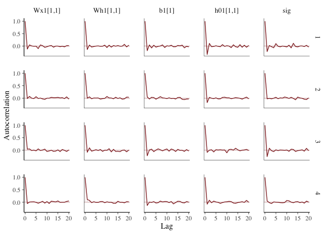
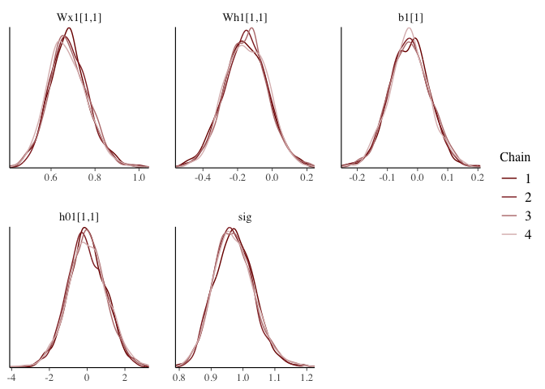
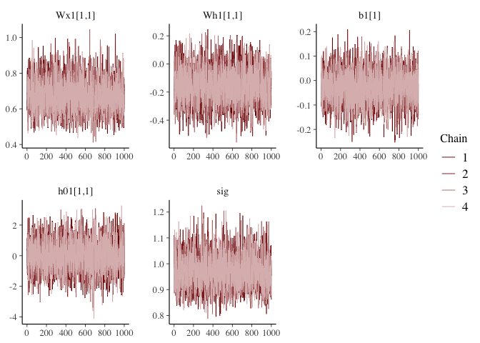
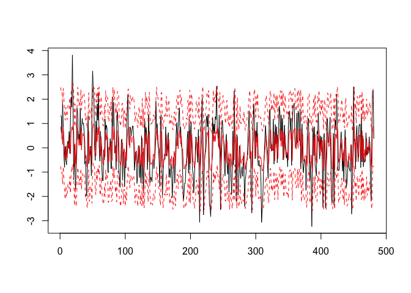
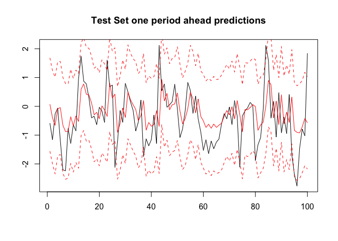
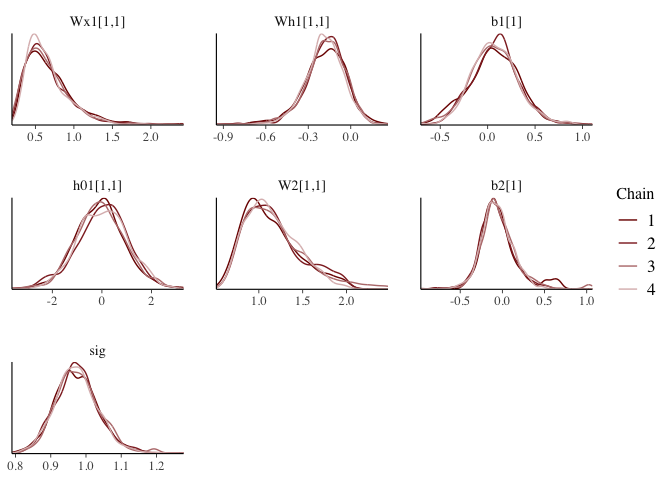
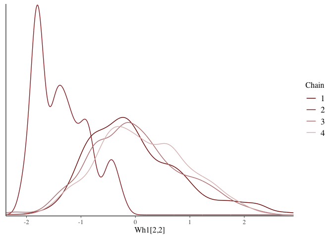

<!-- README.md is generated from README.Rmd. Please edit that file -->

# quickbnnr

<!-- badges: start -->
<!-- badges: end -->

The goal of quickbnnr is to provide a fast and quick implementation of
Bayesian Neural Networks. This is work in progress and so far includes
various forms of Dense layers that use different priors and constraints,
as well as an RNN layer. LSTM layers are planned but are not working
yet.

## Installation

You can install the development version of quickbnnr from
[GitHub](https://github.com/) with:

``` r
# install.packages("devtools")
devtools::install_github("enweg/quickbnnr")
```

## RNN Example

Before we can use `quickbnnr` we must first setup the environment. Since
`quickbnnr` is only an interface to `QuickBNN.jl`, we need to make sure
that Julia is working. This should all be automatically handled by
calling `quickbnnr_setup()` at the beginning of every session.

``` r
library(quickbnnr)
quickbnnr_setup(nthreads = 4, seed = 6150533) # We will want to sample in parallel later
#> Julia version 1.7.2 at location /Applications/Julia-1.7-Rosetta.app/Contents/Resources/julia/bin will be used.
#> Loading setup script for JuliaCall...
#> Finish loading setup script for JuliaCall.
#> Set the seed in both Julia and R to 6150533
```

Lets say you have a sequence of univariate data. This might, for
example, be the returns of a single stock or stock index for various
time points. If your goal is to predict the next value of the sequence
given a certain lock back horizon, what you are facing is a
sequence-to-one problem. For example, if you have 100 data points on a
stock index and wish to predict the next value given the last 20, what
you can do it to split the full 100 sample period into sequences of
length 20. These are then the training data. Each of these sequences is
then fed through a RNN and the next value is predicted.

Denoting net(*x*) the output of the network for all sequences (this
would be a vector with one point per sequence - or better subsequence),
we can write the first model as

$$
\\theta_i \\sim \\text{Normal}(0, 1) \\quad\\forall i \\\\
\\sigma \\sim \\text{InverseGamma}(1, 1) \\\\
y \\sim \\text{MvNormal}(\\text{net}(x), \\sigma\*I)
$$

Thus, the standard RNN model implements a standard normal prior for all
coefficients of the RNN and an Inverse Gamma prior for the standard
deviation. The likelihood is then modelled as a Normal.

To demonstrate this model, we will be working with a simple AR(1)
process.

``` r
data <- arima.sim(list(ar = 0.5), n = 600)
y_test <- data[501:600]
y <- data[1:500]
```

`quickbnnr` expects a tensor (3d array) of dimensions
features × num sequences × length sequence for RNN models. We thus need
to create such a tensor. The following helper function can be used,
where we split the full 500 long sample into sequences of length 20. The
last slice are then the training labels, while all the other slices are
the training data.

``` r
tensor <- tensor_embed(y, len_seq = 20)
y <- tensor[,,20]
x <- tensor[,,1:19, drop = FALSE]
```

We can now specify a network. This is done using the `Chain` function,
which essentially chains together layers. We will be using a Bayesian
RNN layer (`BRNN`) and a simple Bayesian Dense layer (`BDense`).

``` r
spec1 <- Chain(BRNN(1, 1)) # we have one input (only one feature) and one output
spec2 <- Chain(BRNN(1, 1), BDense(1, 1)) # same as above but with an extra linear output layer
spec3 <- Chain(BRNN(1, 5), BDense(5, 1)) # same as above, but with a hidden state of size 5
```

Having defined these specifications, we need to create the actual
networks. This is done by calling `make_net` which takes a specification
and creates the network in QuickBNN.jl

``` r
net1 <- make_net(spec1)
net2 <- make_net(spec2)
net3 <- make_net(spec3)
```

At this point we have a network but not a full model yet. To obtain a
full model, we need to bring together the network structure, the data,
and a likelihood function. In this case, we will be using a Gaussian
likelihood. A model is created by calling `BNN`.

``` r
model1 <- BNN(net1, y, x, likelihood = "normal_seq_to_one")
model2 <- BNN(net2, y, x, likelihood = "normal_seq_to_one")
model3 <- BNN(net3, y, x, likelihood = "normal_seq_to_one")
```

At the moment only the NUTS sampler is supported and also only in its
default implementation. This is often good enough for small models.
**Future work will implement faster approximate methods and allow for
changing of NUTS parameters**. We can estimate the models by calling
`estimate` and specifying how many draws and how many chains we want to
use. Note: if `nthreads` in `quickbnnr_setup` is greater than one, then
chains will be drawn in parallel. The first execution usually takes
longer. This is due to the just-in-time compilation of the underlying
Julia code. If STAN was chosen instead, then compilation would be done
ahead of time, explaining why it often seems like it is drawing faster.
Actual drawing - after the just-in-time compilation finished, should be
fast for small models.

``` r
draws_model1 <- estimate(model1, niter = 1000, nchains = 4)
```

`quickbnnr` supports the use of `bayesplot`, making visual checks easy
to implement. Additionally, estimate always prints out a summary, which
can be also obtained by calling `summary` on the estimated model.

``` r
summary(draws_model1) # calling summary to see ess and rhat
#>   Parameter         mean        std    naive_se         mcse      ess
#> 1  Wx1[1,1]  0.678920158 0.08849544 0.001399236 0.0014343030 3900.422
#> 2  Wh1[1,1] -0.152574015 0.12291692 0.001943487 0.0019872369 4005.438
#> 3     b1[1] -0.027134174 0.06648847 0.001051275 0.0009143824 5256.115
#> 4  h01[1,1] -0.003414349 1.00043728 0.015818302 0.0137475698 5298.801
#> 5       sig  0.971989659 0.06239256 0.000986513 0.0008411766 5193.507
#>   ess_per_sec      rhat
#> 1    31.95181 1.0005578
#> 2    32.81210 0.9995171
#> 3    43.05750 0.9992837
#> 4    43.40718 0.9995138
#> 5    42.54462 0.9993698
```

Both ESS and RHAT seem to be reasonable here. We can also visually check
this and check the autocorrelations. The graphs below show that visually
there are also no problems.

``` r
library(bayesplot)
#> This is bayesplot version 1.9.0
#> - Online documentation and vignettes at mc-stan.org/bayesplot
#> - bayesplot theme set to bayesplot::theme_default()
#>    * Does _not_ affect other ggplot2 plots
#>    * See ?bayesplot_theme_set for details on theme setting
bayesplot::color_scheme_set(scheme = "red")
mcmc_acf(draws_model1$draws)
```



``` r
mcmc_dens_overlay(draws_model1$draws)
```



``` r
mcmc_trace(draws_model1$draws)
```



Posterior predictions can be obtained by calling `predict`. If new data
is provided, this new data is being used, otherwise the training is
used.

``` r
predictions <- predict(draws_model1, x) # using training data
```

We can compare these predictions/fitted values to the actual values.
Note though that the first model only uses an RNN layer with a tanh
activation function. As such, output values can never lie outside \[-1,
1\], explaining the need for model2 which includes another linear layer
allowing for outputs outside this range.

``` r
p.mean <- apply(predictions, 3, mean)
p.q95 <- apply(predictions, 3, function(x) quantile(x, 0.95))
p.q05 <- apply(predictions, 3, function(x) quantile(x, 0.05))
plot(1:length(y), y, "l", xlab = "", ylab = "")
lines(1:length(y), p.mean, col = "red")
lines(1:length(y), p.q95, col = "red", lty = 2)
lines(1:length(y), p.q05, col = "red", lty = 2)
```



We can do the same using test data. First we need to prepare the test
data along the lines of what we saw above.

``` r
x_test <- c(y[(length(y)-19+1):length(y)], y_test[-length(y_test)])
tensor_test <- tensor_embed(x_test, len_seq = 19) # we prevously took the last slice as labels 
predictions_test <- predict(draws_model1, x = tensor_test)
pt.mean <- apply(predictions_test, 3, mean)
pt.q95 <- apply(predictions_test, 3, function(x) quantile(x, 0.95))
pt.q05 <- apply(predictions_test, 3, function(x) quantile(x, 0.05))


plot(1:length(y_test), y_test, "l", xlab = "", ylab = "", 
     main = "Test Set one period ahead predictions")
lines(1:length(y_test), pt.mean, col = "red")
lines(1:length(y_test), pt.q95, col = "red", lty = 2)
lines(1:length(y_test), pt.q05, col = "red", lty = 2)
```



### Comparing to other models

For the second model, in which we also use a linear output layer,
everything seems to be fine. Rhats are within reasonable values, so are
ESS and the density plots show nice unimodal distributions. This latter
fact is a rarety in Bayesian Neural Networks and will not be true for
larger models.

``` r
draws_model2 <- estimate(model2, niter = 1000, nchains = 4)
summary(draws_model2)
#>   Parameter        mean       std     naive_se        mcse       ess
#> 1  Wx1[1,1]  0.66109503 0.2894324 0.0045763277 0.009947281  965.4523
#> 2  Wh1[1,1] -0.18159796 0.1427919 0.0022577388 0.003661903 1646.5820
#> 3     b1[1]  0.07240814 0.2508920 0.0039669501 0.008261401  909.0558
#> 4  h01[1,1] -0.01232151 1.0010851 0.0158285458 0.018223170 2776.0828
#> 5   W2[1,1]  1.15722469 0.3201408 0.0050618698 0.013203624  503.6295
#> 6     b2[1] -0.04790161 0.2086612 0.0032992228 0.009298801  379.4206
#> 7       sig  0.97481411 0.0614491 0.0009715957 0.001033033 2647.0401
#>   ess_per_sec     rhat
#> 1    7.106961 1.004572
#> 2   12.120946 1.001112
#> 3    6.691811 1.003206
#> 4   20.435514 1.000744
#> 5    3.707356 1.007635
#> 6    2.793020 1.009611
#> 7   19.485595 1.000784
```

``` r
mcmc_dens_overlay(draws_model2$draws)
```



For example, for model three we encounter multimodality and chains seem
to mix badly, as indicated by the often high Rhats. The multimodality of
larger and deeper models makes sampling from it difficult.

``` r
draws_model3 <- estimate(model3, niter = 1000, nchains = 4)
summary(draws_model3)
#>    Parameter        mean        std    naive_se        mcse       ess
#> 1   Wx1[1,1] -0.01842617 0.69323139 0.010960951 0.051182451 115.62562
#> 2   Wx1[2,1] -0.21867239 0.93307021 0.014753135 0.091670576  20.45667
#> 3   Wx1[3,1] -0.04133090 0.66525084 0.010518539 0.054653890  92.17074
#> 4   Wx1[4,1] -0.13232785 0.77477835 0.012250321 0.065253759  33.39400
#> 5   Wx1[5,1] -0.15090973 0.74074447 0.011712198 0.062637088  64.66602
#> 6   Wh1[1,1] -0.30893896 1.12508499 0.017789156 0.107696524  17.56463
#> 7   Wh1[2,1] -0.48205893 1.14960912 0.018176916 0.116931183  15.88808
#> 8   Wh1[3,1] -0.36026488 1.13364759 0.017924542 0.107309125  23.81687
#> 9   Wh1[4,1]  0.16333502 0.92743282 0.014664000 0.067676556  80.34500
#> 10  Wh1[5,1] -0.05798644 0.90045013 0.014237367 0.066257850  57.26466
#> 11  Wh1[1,2]  0.28824966 1.09993790 0.017391545 0.108804098  19.03160
#> 12  Wh1[2,2] -0.29640363 0.98181130 0.015523800 0.095000209  17.84078
#> 13  Wh1[3,2]  0.28796791 1.08463792 0.017149631 0.102169275  25.22149
#> 14  Wh1[4,2]  0.19031342 0.86418966 0.013664038 0.063999685  42.23822
#> 15  Wh1[5,2] -0.19879103 0.90400312 0.014293544 0.065078130  78.54291
#> 16  Wh1[1,3] -0.11574699 0.96982057 0.015334210 0.081307052  35.77782
#> 17  Wh1[2,3] -0.09824173 0.86354233 0.013653803 0.065123312 134.37037
#> 18  Wh1[3,3]  0.47092590 1.03559715 0.016374229 0.100555825  20.90406
#> 19  Wh1[4,3]  0.09611206 0.86551862 0.013685051 0.063872153 142.99924
#> 20  Wh1[5,3] -0.04918981 0.84896011 0.013423238 0.057344367 149.62756
#> 21  Wh1[1,4]  0.03201896 0.91438109 0.014457634 0.083258908  24.96829
#> 22  Wh1[2,4]  0.12475794 0.87071318 0.013767184 0.060501152  77.09374
#> 23  Wh1[3,4]  0.07467316 0.90493270 0.014308242 0.062526410 117.54852
#> 24  Wh1[4,4] -0.09077772 0.85311605 0.013488949 0.070333264  31.81794
#> 25  Wh1[5,4]  0.11619616 0.88925986 0.014060433 0.070955444  42.08481
#> 26  Wh1[1,5] -0.31398672 0.98875472 0.015633585 0.085117578  35.17273
#> 27  Wh1[2,5] -0.19846882 1.04887859 0.016584227 0.099479361  20.11176
#> 28  Wh1[3,5] -0.10467026 0.92257644 0.014587214 0.069016273  44.03888
#> 29  Wh1[4,5]  0.45348078 1.09131645 0.017255228 0.104333824  19.96255
#> 30  Wh1[5,5]  0.09058040 0.95501063 0.015100044 0.090447057  29.68196
#> 31     b1[1] -0.45037396 1.32269241 0.020913603 0.139478939  15.98164
#> 32     b1[2]  0.00896221 0.94227111 0.014898614 0.070055805 123.09376
#> 33     b1[3]  0.09805458 1.06083992 0.016773352 0.091358800  39.85380
#> 34     b1[4] -0.23329332 1.03596942 0.016380115 0.080148188  73.21047
#> 35     b1[5]  0.24888578 1.12544526 0.017794852 0.103198587  23.50404
#> 36  h01[1,1]  0.05493699 0.98337141 0.015548467 0.067226275  51.17145
#> 37  h01[2,1]  0.04103759 0.94474830 0.014937782 0.062297034  88.77351
#> 38  h01[3,1]  0.06360111 0.89296126 0.014118957 0.045857387 187.68855
#> 39  h01[4,1]  0.07901821 0.94869670 0.015000212 0.057709738 133.80238
#> 40  h01[5,1] -0.34786459 1.00642928 0.015913044 0.076688605  27.33694
#> 41   W2[1,1] -0.02496607 0.70825832 0.011198547 0.062000597  36.53870
#> 42   W2[1,2] -0.09823687 0.69903905 0.011052778 0.060033350  36.85320
#> 43   W2[1,3]  0.12837475 0.79906651 0.012634351 0.069503038  34.99126
#> 44   W2[1,4] -0.22425274 0.71770292 0.011347880 0.060845104  25.38016
#> 45   W2[1,5] -0.18597675 0.71537233 0.011311030 0.062935866  30.43842
#> 46     b2[1]  0.11165126 0.68526208 0.010834945 0.047426855  59.75949
#> 47       sig  0.95216563 0.06416057 0.001014468 0.004063442 223.38112
#>    ess_per_sec     rhat
#> 1  0.012897486 1.036716
#> 2  0.002281844 1.277396
#> 3  0.010281207 1.029267
#> 4  0.003724941 1.134954
#> 5  0.007213186 1.057208
#> 6  0.001959251 1.364826
#> 7  0.001772239 1.403463
#> 8  0.002656658 1.188493
#> 9  0.008962102 1.041921
#> 10 0.006387600 1.101057
#> 11 0.002122884 1.277109
#> 12 0.001990054 1.375939
#> 13 0.002813337 1.176808
#> 14 0.004711472 1.114296
#> 15 0.008761088 1.068985
#> 16 0.003990845 1.137965
#> 17 0.014988374 1.023206
#> 18 0.002331748 1.239209
#> 19 0.015950884 1.015898
#> 20 0.016690241 1.046210
#> 21 0.002785094 1.197134
#> 22 0.008599439 1.074068
#> 23 0.013111977 1.033528
#> 24 0.003549140 1.171849
#> 25 0.004694360 1.086502
#> 26 0.003923351 1.097522
#> 27 0.002243371 1.277974
#> 28 0.004912327 1.096193
#> 29 0.002226728 1.281706
#> 30 0.003310881 1.139386
#> 31 0.001782676 1.371894
#> 32 0.013730522 1.037034
#> 33 0.004445502 1.105485
#> 34 0.008166279 1.071733
#> 35 0.002621764 1.261027
#> 36 0.005707932 1.086006
#> 37 0.009902261 1.054011
#> 38 0.020935763 1.030480
#> 39 0.014925017 1.032942
#> 40 0.003049306 1.203664
#> 41 0.004075718 1.108863
#> 42 0.004110798 1.131327
#> 43 0.003903109 1.134985
#> 44 0.002831036 1.198494
#> 45 0.003395260 1.160756
#> 46 0.006665886 1.079786
#> 47 0.024917098 1.024305
```

Interestingly, this outcome corresponds rather nicely to a discussion in
chapter 17.5 of Murphy (2023) about the generalisation properties of
Bayesian Deep Learning and sharpe vs. flat minima. Here, the left model
might very well correspond to an overfitting and overconfidenty
parameterisation, while the flatter model that has been better explored
would correspond to the better generalising parameterisation. As such,
even though the chains did not mix well, they still might be useful to
obtain first uncertainty estimates. Encountering such a sharp mode might
also point towards an overparameterisation of the network, which clearly
is the case here in which we want to approximate a AR(1) model with a
RNN that has a hidden state of size five.

``` r
param <- draws_model3$draws[,,"Wh1[2,2]", drop = FALSE]
mcmc_dens_overlay(param)
```



### T-Distribution

If errors are more likely to have fatter tails, then the Gaussian
likelihood might not be appropriate. In such circumstances, a
t-distribution can be used. Here the assumption is that
$\\frac{y - \\text{net(x)}}{\\sigma} \\sim T(\\nu)$. *ν* must be given
by the modeller.

``` r
model1_tdist <- BNN(net1, y, x, likelihood = "tdist_seq_to_one")
summary(model1_tdist)
#>          Length Class  Mode   
#> juliavar    2   -none- list   
#> y         481   -none- numeric
#> x        9139   -none- numeric
```

<div id="refs" class="references csl-bib-body hanging-indent">

<div id="ref-pml2Book" class="csl-entry">

Murphy, Kevin P. 2023. *Probabilistic Machine Learning: Advanced
Topics*. MIT Press. [probml.ai](https://probml.ai).

</div>

</div>
